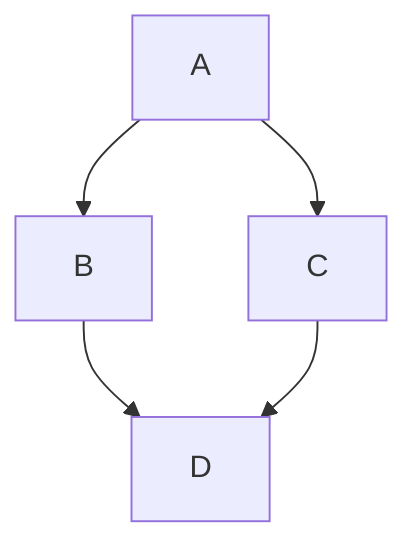

# Introduction

$a^2 + b^2 = c^2$


```mermaid
graph TD;
    A-->B;
    A-->C;
    B-->D;
    C-->D;
```

```yaml
receivers:
  journald: true

service:
  extension:
    - file_storage
```

```splunk-spl
index=main
| stats count by host
```

```systemd
[Service]

```